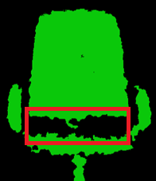
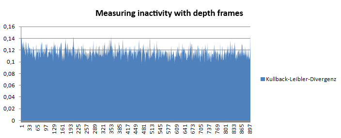
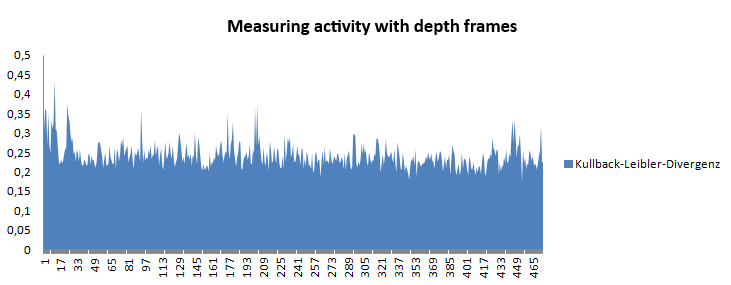
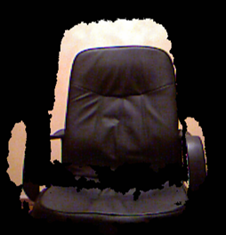
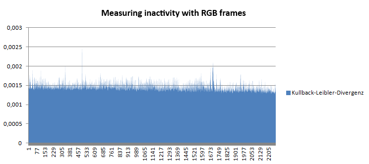

# Report: Activity Monitor with Kullback-Leibler Divergence

Activity monitor with Kullback–Leibler divergence for realtime camera streams.

### Kullback-Leibler Divergence Implementation in Python

The implementation of the Kullback-Leibler divergence in Python is shown in below. The implementation was taken from the statistical software **R** and reprogrammed in Python. See: [R package of Kullback-Leibler Divergence](https://search.r-project.org/CRAN/refmans/philentropy/html/KL.html)

```python
def calculate_kullback_leibler(new_frame, old_frame):
    # Accumulate the values in the old_frame array
    spec1_sum = np.sum(old_frame)
    # Accumulate the values in the new_frame array
    spec2_sum = np.sum(new_frame)

    kullback_d1 = 0
    kullback_d2 = 0

    # Calculate the Kullback-Leibler Divergence
    for i in range(len(new_frame)):
        spec1 = old_frame[i] / spec1_sum
        spec2 = new_frame[i] / spec2_sum

        # Ensure no division by zero
        if spec1 != 0 and spec2 != 0:
            kullback_d1 += spec1 * np.log(spec1 / spec2) / np.log(2)  # log base 2
            kullback_d2 += spec2 * np.log(spec2 / spec1) / np.log(2)

    # Return the average of the two divergences
    return (kullback_d1 + kullback_d2) / 2
```

The method takes two frames as parameters. One frame is the current frame (`newFrame`), and the other is the previous frame (`oldFrame`). The divergence of the two frames is then calculated. The divergence is compared with a threshold value. If the divergence is above the threshold, a change is detected; if it is below the threshold, no change is detected.

---

### Application of the Kullback-Leibler Divergence to Depth Frames

In an initial experiment, the algorithm was applied to the depth frames. In the depth frames, the pixel values represent the distance from the operator to the Kinect in millimeters, instead of color information. However, the image data exhibits significant noise. This noise is attributed to the following reasons:

- The infrared signals emitted by the Kinect can interfere.
- The infrared signals are absorbed by black and rough surfaces.
- Object edges may not be clearly recognized, leading to increased noise.


_Figure 1: Green chair_

In **Figure 1**, a depth frame of a leather chair is shown. The distance values are color-coded to make the depth frame visible. Here, the noise in the lower red region is clearly visible. Although this noise doesn't present a major obstacle, the fluctuations in pixel values due to noise may exceed the movements of the operator, causing small movements to go undetected. Furthermore, the depth frames are calculated here using the Kullback-Leibler divergence, as shown in Listing \ref{lst:KullbackLeibler}. This allows the detection of whether movement has occurred. The noise is so large that the program detects a movement, and the image is colored green.

To address this issue, attempts were made to eliminate the noise. The depth frames were divided into $5 \times 5$ areas. The average value of each area was calculated, and each pixel in these areas was assigned the calculated average value. The result is shown in Figure \ref{fig:RedChair}.


_Figure 2: Red chair_

In **Figure 2**, it is evident that the noise has less impact on the resulting image. The leather chair is now drawn in red, indicating no movement. However, the noise is still large enough that small movements are not detected. Therefore, RGB frames were considered, and these were also calculated using the Kullback-Leibler divergence.

#### Advantages of Depth Frames:

- Depth frames contain less information, allowing for faster computation.
- Depth frames can be cropped both forwards and backwards. Since a depth frame consists of distance data, this data can be filtered within the application.

#### Disadvantages of Depth Frames:

- Accurate calculation depends on the quality of the input data. If the signal-to-noise ratio is high in the input data, the calculation may not provide the desired information.

#### Results:

Two tests were conducted using depth frames. The first test shows the inactivity of the user, and the second test detects user activity. A threshold value was assumed to determine activity or inactivity. The threshold values were determined based on tests and represent suitable values.

- **Detecting Inactivity of the User:**
  The subject sits motionless for ten minutes in front of the Kinect. The Kinect is approximately two meters away from the subject and is facing them. Every fifteenth frame is calculated. A threshold of 0.18 was assumed. If the Kullback-Leibler divergence is lower than the threshold, the user is considered inactive for the application. The result is shown in **Figure 3** .

  
  _Figure 3: Inactivity test_

  In this experiment, inactivity was detected with 100% probability. A total of 900 distances were calculated, with the maximum value being 0.151 and the minimum value being 0.096.

- **Detecting Activity of the User:**
  This test is used to detect user activity. To make the implementation more efficient, the movements of the subject were greatly reduced. The subject sits for four minutes in front of the Kinect, playing with their smartphone, and only moves one hand. The Kinect is approximately two meters away from the subject and is facing them. Every fifteenth frame is calculated. A threshold of 0.18 was assumed. If the Kullback-Leibler divergence is greater than the threshold, the user is considered active for the application. The result is shown in **Figure 4**.

  
  _Figure 4: Activity test_

  In this experiment, activity was detected with a probability of 99.78%. A total of 474 distances were calculated, with the maximum value being 0.435 and the minimum value being 0.175.

---

### Application of the Kullback-Leibler Divergence to RGB Frames

Since detecting small movements in the depth frames was not possible due to noise, the Kullback-Leibler divergence was applied to RGB frames, where the signal-to-noise ratio is much better. This method has a problem: RGB frames cannot be cropped forwards or backwards. If a person moves in the background of the user, activity is detected even though the user has not moved.

To address this, a new solution was evaluated. Since the depth frames can be cropped backwards, the RGB frame information was fused with the depth frame information. As a result, only the person in a specific area is visible. The result is shown in **Figure 5**.


_Figure 5: Colored chair_

#### Advantages of RGB Frames:

- The signal-to-noise ratio is much lower than in depth frames.
- The user's movements are easier to detect because three pixel values (red, green, blue) change, rather than just the distance pixel value. This multidimensional information allows for finer threshold adjustments.

#### Disadvantages of RGB Frames:

- Color images cannot be cropped backwards, but this issue was solved by overlaying RGB frame information with depth frame information.
- Computation takes longer than with depth frames.
- If the lighting conditions in the room change, the threshold must be adjusted.

#### Results:

A test was conducted using RGB frames to detect inactivity. This test shows that the signal-to-noise ratio is lower, allowing for better detection.

The subject sits motionless for ten minutes in front of the Kinect. The Kinect is approximately two meters away from the subject and is facing them. Every third frame is calculated. A threshold of 0.003 was assumed. If the Kullback-Leibler divergence is lower than the threshold, the user is considered inactive for the application. The result is shown in **Figure 6**.


_Figure 6: Inactivity test with colored image_

In this experiment, inactivity was detected with 100% probability. A total of 2274 distances were calculated, with the maximum value being 0.00276 and the minimum value being 0.00127.

The difference between the maximum and minimum values is very small compared to the depth frames. The calculated distances are also 100 times smaller than with the depth frames. Therefore, the threshold can be adjusted more finely, making it possible to detect smaller movements.
